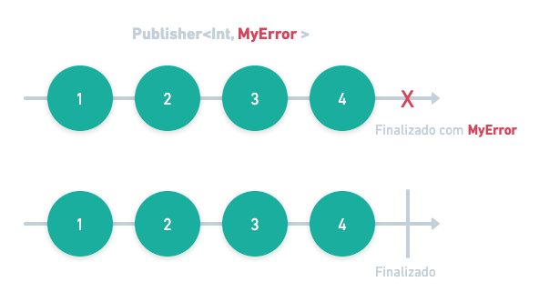
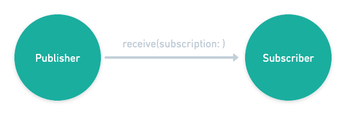
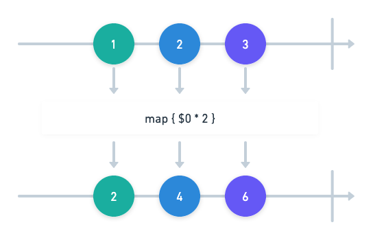
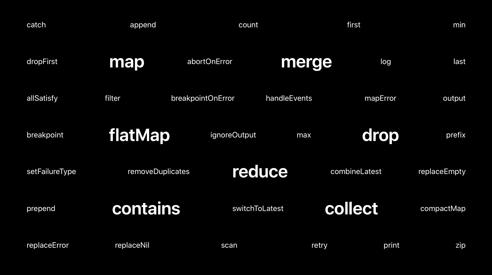

<!-- # Introdução ao Combine -->


<i>"Uma API declarativa do Swift para processar valores ao longo do tempo. Esses valores podem representar muitos tipos de eventos assíncronos"</i>

<p align="center">

</p>

#### Combine é constituído principalmente por:

1. [Publishers](#publishers)
2. [Subscribers](#subscribers)
3. [Subscriptions](#subscriptions)
4. [Subjects](#subjects)
5. [Operators](#operators)

## Publishers

> Os publishers são tipos que podem emitir valores ao longo do tempo para uma ou mais partes interessadas, como **subscribers**.

```swift
protocol Publisher {
    associatedtype Output // tipo de valores que o publisher emite
    associatedtype Failure: Error // tipo de erro que o publisher pode emitir

    func receive<S>(subscriber: S)
        where S : Subscriber, Self.Failure == S.Failure, Self.Output == S.Input
}
```

Um publisher pode emitir três tipos de eventos:

- Output
- Completion:

  - Finished
  - Failure

  

<!-- ```swift
/// Publishers.Sequence<[Int], Never>
let myArrayPublisher = [0, 1, 2, 3, 4].publisher

// Publishers.Sequence<(ClosedRange<Int>), Never>
let myRangePublisher = (0...5).publisher

// NotificationCenter.Publisher
let myNotificationPublisher = NotificationCenter.default.publisher(for: Notification.Name("MyNotification"), object: nil)

let myJustPublisher = Just(2)

class MyObject {
    // Um property wrapper que adiciona um publisher a qualquer propriedade
    @Published var word = ""
}

// Future <Int, Never>
``` -->

## Subscribers

> Um Subscriber se inscreve em um Publisher para receber seus valores.

```swift
protocol Subscriber {
    associatedtype Input // Tipo de valores que o subscriber recebe
    associatedtype Failure: Error // Tipo de erro que o subscriber pode receber

    // ...
}
```

## Subscriptions

> Subscriptions representam a conexão entre publishers e subscribers.

- Publishers fornecem uma Subscription para seus subscribers:



- Uma subscription possui o método **.cancel()** utilizado para desalocar uma assinatura.

### Consumindo publishers

Combine nos fornece dois assinantes como operadores de um Publisher:

- `sink(receiveCompletion:receiveValue:)`

```swift
let publisher = [0, 1, 2, 3, 4].publisher

let subscription = publisher
    .sink(
        receiveCompletion: { completion in
            print("Completion: \(completion)")
        },
        receiveValue: { value in
            print("Value: \(value)")
        }
    )

// Saída:
// Value: 0
// Value: 1
// Value: 2
// Value: 3
// Value: 4
// Completion: finished
```

- `assign(to:on:)`

```swift
class MyClass {
    var anInt: Int = 0 {
        didSet {
            print("anInt was set to: \(anInt)", terminator: "; ")
        }
    }
}

var myObject = MyClass()
let myRange = (0...2)
let subscription = myRange.publisher.assign(to: \.anInt, on: myObject)

// Saída:
// "anInt was set to: 0; anInt was set to: 1; anInt was set to: 2"
```

## Subjects

> Subject é um publisher usado para "injetar" valores em um fluxo.

- `PassthroughSubject<Output, Failure>`: permite que você publique novos valores sob demanda;
  - Útil para notificar interações do usuário

```swift
let subject = PassthroughSubject<String, Never>()

let subscription = subject
    .sink(
        receiveCompletion: { print("Completion: \($0)") },
        receiveValue: { print("Value: \($0)") }
    )

subject.send("Hello")
subject.send("World")
subject.send(completion: .finished)
subject.send("!")

// Saída:
// Value: Hello
// Value: World
// Completion: finished

```

- `CurrentValueSubject<Output, Failure>`: baseado no PassthroughSubject, porém permite saber qual o seu valor atual:

```swift
let subject = CurrentValueSubject<Int, Never>(0)

let subscription = subject
    .sink(receiveValue: { print($0) })

subject.send(1)
subject.send(2)

print("current value \(subject.value)")

subject.value = 3

print("current value \(subject.value)")

// Saída:
// 0
// 1
// 2
// current value 2
// 3
// current value 3
```

## Operators

> Operators montam uma cadeia de republishers que processa elementos produzidos por publishers upstream.

```swift
let publisher = (1...3).publisher

let subscription = publisher
    .map { $0 * 2 }
    .sink(receiveValue: { print($0) })

// Saída:
// 2
// 4
// 6
```



#### Encadeamento de operadores

```swift
let publisher1 = [1, 1, 2, 2, 3, 3].publisher
let publisher2 = [4, 4, 5, 5, 6, 6].publisher

let formatter = NumberFormatter()
formatter.numberStyle = .spellOut

let subscription = publisher1
    .merge(with: publisher2)
    .removeDuplicates()
    .map { formatter.string(for: NSNumber(integerLiteral: $0)) ?? "" }
    .sink { print($0) }

// Saída:
// one
// two
// three
// four
// five
// six
```



## Links úteis
### Livros
- <a href="https://www.raywenderlich.com/books/combine-asynchronous-programming-with-swift/v3.0" target="_blank">Combine: Asynchronous Programming with Swift</a>
### Artigos
- <a href="https://www.avanderlee.com/swift/combine/" target="_blank">Getting started with the Combine framework in Swift</a>
- <a href="https://medium.com/@arlindaliu.dev/problem-solving-with-combine-swift-4751885fda77" target="_blank">Problem Solving with Combine Swift</a>
### Vídeos
- <a href="https://youtu.be/fejmsuxoIvA" target="_blank">try! Swift NYC 2019 - Getting Started with Combine</a>
- <a href="https://youtu.be/IAKco9XaPgg" target="_blank">Getting started with Combine + UIKit in Swift</a>
- <a href="https://www.youtube.com/watch?v=RysM_XPNMTw" target="_blank">iOS 13 Swift Tutorial: Combine Framework - A Practical Introduction with UIKit</a>
- <a href="https://youtu.be/rqYiA5N4X5w" target="_blank">Migrating to Combine</a>
